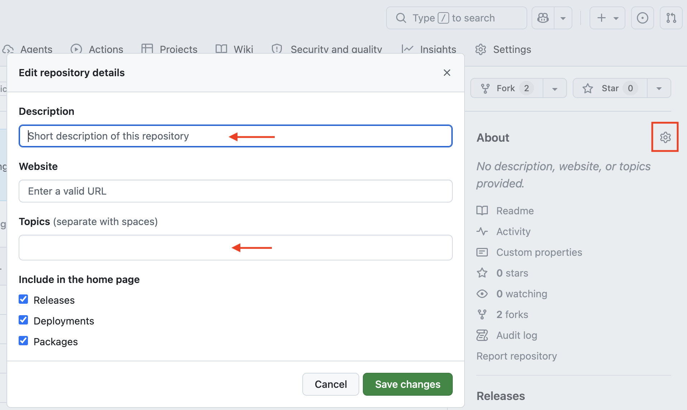
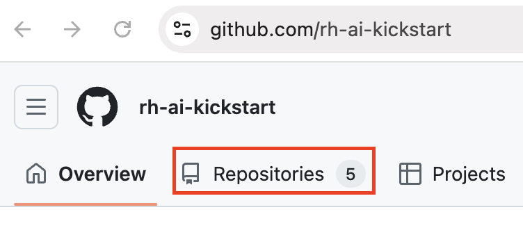
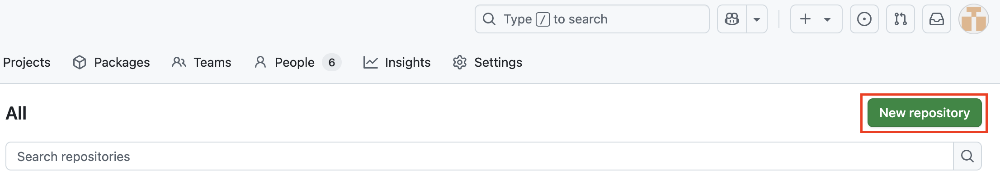
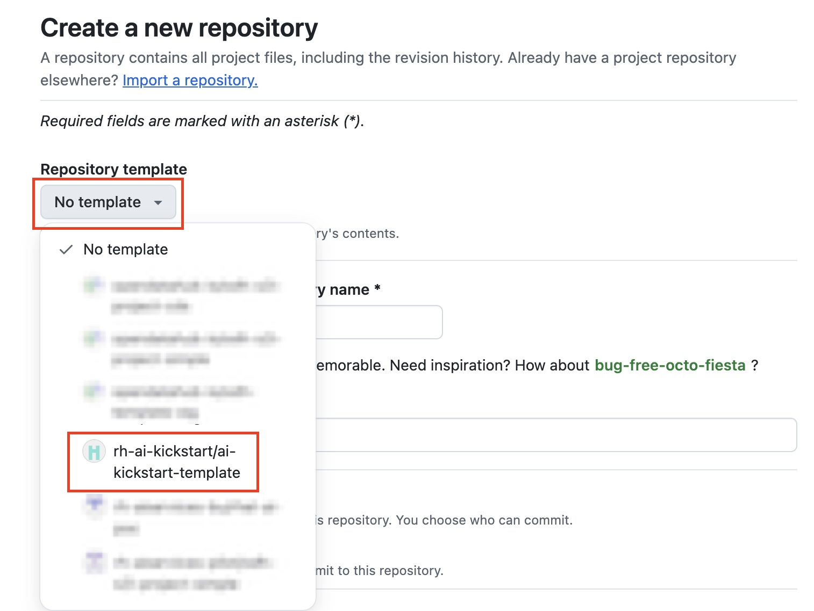
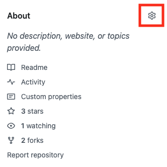
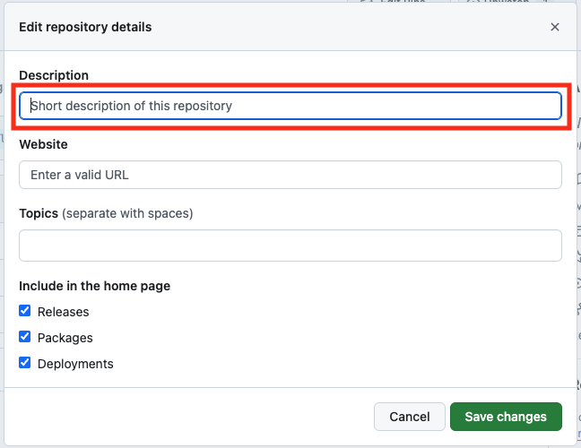

# Welcome builder! 🔨

This guide contains everything you need to create, contribute, and publish AI quickstarts to the guild.

**Create** • **Contribute** • **Publish**

---

##  Quick Start for Builders

**Ready to start building?**

1. [Join the organization](https://github.com/rh-ai-quickstart/ai-quickstart-contrib/issues/new/choose) (request membership)
2. [Create your quickstart](https://github.com/rh-ai-quickstart) (use the template)
3. Follow the [requirements](#requirements)
4. [Publish to redhat.com](PUBLISHING.md) (optional)

---

##  Requirements

Before you build, understand what makes a great quickstart:

### Quickstart Levels

AI quickstarts have **three levels** of maturity, each with increasing requirements:

| Level | Where it lives | Purpose |
|:---:|---|---|
| **Level 1: Community** | GitHub organization (`rh-ai-quickstart`) | Discoverable by the community, experimental, work-in-progress |
| **Level 2: Published** | [docs.redhat.com/learn/ai-quickstarts](https://www.docs.redhat.com/learn/ai-quickstarts) | Curated, high-quality examples that tell compelling stories |
| **Level 3: Integrated** | Partner/product/tool solution integration | Regularly tested, simple, robust examples, included with Red Hat products, bundles or partner solutions |

**Start at Level 1**, get feedback, iterate, then advance to higher levels as your quickstart matures.

---

### Level 1: Community (GitHub Organization)

**Required to join the GitHub organization:**
- ✅ **Descriptive repository name** - Make it easy to find and understand the business use case 
- ✅ **README.md** - Follow the [README specifications](#readme-specifications)
- ✅ **About description** - Add a short description to your GitHub repo (Settings → About)
- ✅ **License** - Add an appropriate open source license to your repository
- ✅ **Images folder** - Put all screenshots/diagrams in `docs/images/`
- ✅ **Status tag** - Mark your quickstart as `work-in-progress` or `completed` (see [tagging guide](#tag-your-quickstart))
- ✅ **Clear business use case** - Show how open source AI can solve a concrete business problem, not just running a specific technology

**Remember:** You aren't just documenting code, you're documenting the **use case**! This is the starting level to reach in order to get into the github organisation. 

---

### Level 2: Published (redhat.com)

**Additional requirements for publication on redhat.com:**
- ✅ **README.md** - *Must* follow the [README specifications](#readme-specifications) below
- ✅ **Red Hat content standards** - Follow Red Hat corporate content standards (see [Publishing Guide](PUBLISHING.md))
- ✅ **Industry tag (README file)** - Required for catalog discoverability (see [industry tags](#industry-tags))
- ✅ **Quality criteria** - Meets most best practices (see [table below](#what-makes-a-good-quickstart))
- ✅ **Arcade or video** - Recommended for users without deployment environments
- ✅ **Completeness** - Fully tested, documented, and ready for community use

See the [Publishing Guide](PUBLISHING.md) for detailed requirements.

---

### Level 3: Integrated (Partner/Product)

**Additional requirements for vendor certification or product integration:**
- ✅ **All previous requirements** - Previous level requirements included
- ✅ **Quality criteria** - Meets all best practices in [table below](#what-makes-a-good-quickstart)
- ✅ **No admin permissions required** - Included in line above, but stating separately: has regular user permissions so anyone can deploy
- ✅ **Strategic use case** - Must showcase industry workloads Red Hat wishes to pursue
- ✅ **Strategic technology** - Must showcase technology advantageous for Red Hat
- ✅ **CI/CD** - Regular, automated testing for regressions and clean deployments required
- ✅ **CVE testing** - Scan your container images, provide updated images or provide ability to build images, when applicable 

*These requirements are continuously updated to address new opportunities. They may change at any time without notice.*

---

### What Makes a Good Quickstart?

| ✅ Best Practices | ❌ Common Pitfalls |
|---|---|
| Deployable by regular users with standard permissions | Only deployable by cluster admins |
| Has an appealing user interface | Just deploys a component with no UI |
| Demonstrates a real industry use case | Focuses only on technology, not the problem it solves |

### README Specifications

Your README must follow this structure for consistency and reusability:

| Order | Section | Level | Required? | Key Criteria |
|:---:|---|:---:|:---:|---|
| 1 | **Quickstart title** | H1 | ✅ | Max length: 64 chars, action-focused & starts with an action verb (Deploy, Boost, Accelerate), describes the **use case** not just tech |
| 2 | **Short description** | Text | ✅ | Max length: 160 chars, explains what users will learn/gain |
| 3 | **Table of contents** | H2 | 📝 Recommended | Standard markdown ToC |
| 4 | **Detailed description** | H2 | ✅ | 2-3 paragraphs on use case and solution (not technical deep dive) |
| 5 | **See it in action** | H3 | 📝 Recommended | Link to videos/Arcades for users without environments |
| 6 | **Architecture diagrams** | H3 | ✅ | Put images in `docs/images/` folder |
| 7 | **Requirements** | H2 | ✅ | List all prerequisites clearly |
| 8 | **Hardware requirements** | H3 | ✅ | Be specific! Not just "GPU" but exact specs |
| 9 | **Software requirements** | H3 | ✅ | Be specific! "OpenShift AI 2.22" not just "OpenShift AI" |
| 10 | **Deploy** | H2 | ✅ | Clear step-by-step instructions, assume limited knowledge |
| 11 | **Delete** | H3 | ✅ | How to cleanly remove when finished |
| 12 | **Reference** | H2 | 📝 Recommended | External links, blogs, documentation |
| 13 | **Optional sections** | H2 | ⭕ Optional | Advanced deployment, technical deep dive, guided experience |
| 14 | **Tags** | H2 | ✅ | Industry tag required (see [tagging guide](#tag-your-quickstart)) |

📖 **Example:** See [ai-quickstart-template](https://github.com/rh-ai-quickstart/ai-quickstart-template) for a properly formatted README.

### Repository requirements

Now for some house keeping requirements. :broom:

| Repository requirement | Description | Instructions |
|:---:|:---:|:---:|
| Repository description | A one sentence description of your AI quickstart. State "what" it is and "why" it's important. | In repository > Click gear in **About** section > Enter description > Save changes |
| Quickstart status tag | Maintain a status tag showing publication status of your quickstart (see below for appropriate tags). | In repository > Click gear in **About** section > Enter status tag under **Topics** > Save changes | 
| LICENSE file | All AI quickstarts must include an appropriate LICENSE file | *Additional guidance soon* | 

*quick screenshot showing where to find the "repository details" section*. 

#### AI quickstart status tags 
| Status tag | Description & When to use | 
|:---:|:---:| 
| helper | Use this when the repository is not a quickstart, but serves another purpose in the organization, i.e. documentation repositories, templates, supporting repositories | 
| work-in-progress | Use this while you're working on your quickstart. If it's not completed or published, it's WIP. |
| completed | Use this status tag when you consider the quickstart complete, but not yet published |
| published | Your quickstart is complete and published on docs.redhat.com/learn/ai-quickstarts | 
| deprecated | Used when the quickstart is old and no longer maintained |

---

##  Join the organization

To create quickstarts in the rh-ai-quickstart organization, you need membership.

**How to join:**
1. Go to [ai-quickstart-contrib issues](https://github.com/rh-ai-quickstart/ai-quickstart-contrib/issues)
2. Click **"New issue"**
3. Select **"Membership request"**
4. Fill out the form with your GitHub username

---

##  Create your quickstart

### Start from the template

**Steps:**

1. Go to [rh-ai-quickstart](https://github.com/rh-ai-quickstart)
2. Click **"Repositories"**

3. Click **"New repository"** (top right)

4. Select template: `rh-ai-quickstart/ai-quickstart-template`

5. Name your repository (descriptive!)
6. Make it **Public**
7. Click **"Create repository"**
8. Build! 🚀

**Don't forget:**
- Replace placeholder text in the template README
- Add a description to your repository (click gear icon → add description)

### What the template provides

- README.md structure (you fill in the content)
- `docs/images/` folder for screenshots
- `.github/workflows/` for publication automation

---

##  Create an arcade (Recommended)

Not required, but highly recommended! Not everyone has immediate access to a deployment environment.

**What is an Arcade?** Interactive demos that let users experience your quickstart without deploying.

**How to create one:** Red Hatters can search `"interactive experiences (Arcade)"` on the Source.

**Tips:**
- Link to your Arcade in the README's "See it in action" section
- Export as video and embed it in your README for extra visibility

---

##  Bring an existing quickstart

Already have a quickstart? Two ways to bring it into the organization:

### Option 1: Fork (Simple & Fast)

1. In your repository, click **"Fork"**
2. Select **"rh-ai-quickstart"** as the owner
3. Rename if needed
4. Click **"Create fork"**

### Option 2: Transfer ownership

**If you're an owner of rh-ai-quickstart with admin on the source repo:**

1. Go to your repo → **Settings**
2. Scroll to **"Danger Zone"**
3. Click **"Transfer"**
4. Select **"rh-ai-quickstart"** from organizations
5. Confirm transfer

**If you have admin but aren't an owner:**
1. Make an rh-ai-quickstart owner an admin on your repo
2. Ask them to transfer on your behalf

---

##  Tag your quickstart

Tags help users find your quickstart. Required for redhat.com publication.

### Required tags

| Tag | Required? | Example | Notes |
|---|:---:|---|---|
| **Industry** | ✅ | Retail | See [industry list](#industry-tags) below |
| **Partner** | If applicable | Intel | Separate multiple with commas |
| **Product** | ✅ | OpenShift AI | The featured Red Hat product |
| **Use case** | ⭕ Optional | Productivity | |

### Industry tags

Select ONE from this list:
- Automotive
- Banking and securities
- Broadcasting and cable
- Education
- Government
- Health insurance payer
- Healthcare provider
- Insurance
- Life sciences
- Manufacturing
- Media and IT services
- Retail
- Telecommunications
- Transportation
- Utilities
- Wholesale trade

---

## 📤 Publish to redhat.com

Your quickstart is discoverable on GitHub immediately. To get featured on the [AI quickstart catalog](https://docs.redhat.com/en/learn/ai-quickstarts) on redhat.com:

**See the [Publishing Guide](PUBLISHING.md)** for:
- Content quality requirements
- Red Hat branding standards
- Technical publishing workflow

**Note:** Not all quickstarts qualify for redhat.com. The catalog features curated, high-quality examples that tell compelling stories.

---

##  Share your work

**For Red Hatters:** The AI BU runs an OpenShift AI cluster you can use to deploy and demo your quickstart internally. Reach out through internal channels.

---

##  Maintenance responsibility

### Important

**You maintain what you build.** AI quickstarts are maintained by their contributors. 

**What this means:**
- Respond promptly to issues and requests
- Keep your quickstart working as platforms update
- Fix bugs and update documentation

**What happens if you don't?** We may pause promotion of your quickstart on redhat.com until issues are resolved.

---

##  Need help?

- 📝 [Open an issue](https://github.com/rh-ai-quickstart/ai-quickstart-contrib/issues)
- 📚 See the [Publishing Guide](PUBLISHING.md) for content standards
- 🎯 Check the [ai-quickstart-template](https://github.com/rh-ai-quickstart/ai-quickstart-template) for examples

---

_Happy building!_ 🔨

_Built by Red Hat AI experts, partners, and the community_ ✨

