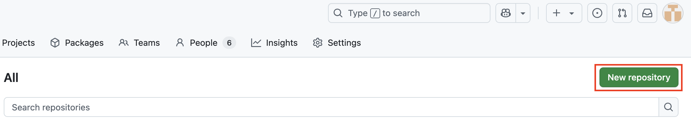
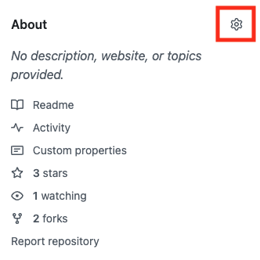

# Welcome to the contributor's guide (FAQ)! :computer: 

Here you'll find details on how to contribute AI quickstarts!

## Table of contents

* [How are quickstarts maintained?](#how-are-quickstarts-maintained)
* [How are AI quickstarts organized?](#how-are-ai-quickstarts-organized)
* [What are the repository requirements?](#what-are-the-repository-requirements)
* [How do I create a new quickstart?](#how-do-i-create-a-new-quickstart)
* [How to publish and promote your quickstart?](#how-to-publish-and-promote-your-quickstart)
* [Can I deploy and share a working example?](#can-i-deploy-and-share-a-working-example) 


## How are quickstarts maintained? 

AI quickstarts are maintained by their contributors. Your quickstarts are maintained by
you. We ask for prompt attention to known issues and requests. If necessary
actions are not completed, we may pause the promotion of your AI quickstart on
redhat.com. 

### :stop: STOP :stop:
Just need to say it once more: 

    **AI quickstart contributors are responsible for the maintenance of their quickstarts!**

## How are AI quickstarts organized? 

Every AI quickstart is its own repository. We do this so they are easy to browse,
clone and deploy! AI quickstarts are collected here in the 
[AI quickstart GitHub Organization](https://github.com/rh-ai-quickstart). 

Here's what it looks like: 

```
rh-ai-quickstart/
├── [vllm-cpu]()/
│   ├── README.md 
│   ├── assets/images/
│   └── helm/
└── [vllm-tool-calling]()/
    ├── README.md 
    ├── assets/images/
    └── vllm-tool-calling/
```

## What are the repository requirements? 

### Required

* A descriptive repo name makes your quickstart easy to find and understand 
* `README.md` - please use README structure found in [ai-quickstart-template](https://github.com/rh-ai-quickstart/ai-quickstart-template)
* Put the images your README uses in the `assets/images/` folder
* Be as descriptive as possible! REMEMBER: you aren't just documenting code, you're documenting the use case
* Add a description to your repo's About section

### What criteria are we using? 

Here are some examples of best practices and common pitfalls: 

| Best practice or pitfall? | Status |
|---|---|
| deployable by a regular user with regular permissions | :white_check_mark: |
| an appealing user interface | :white_check_mark: | 
| conveying an industry use case solved using Red Hat AI | :white_check_mark: |
| examples only deployable by cluster admins | :x: | 
| focusing only on the technology, not the problem it solves | :x: |
| examples that only deploy a single component without a friendly UI or way to us it | :x: |


IMPORTANT: as mentioned in the 
[How to publish and promote your quickstart](#how-to-publish-and-promote-your-quickstart) section, 
select quickstarts will be featured on redhat.com. This curated set will be selected using this criteria to 
promote actionable use cases. Since they will be highly visable, we will highlight the most relevant 
examples that any one can try and tell a compelling story. 

### Optional, but encouraged
* Add "[tags](#tag-your-quickstart)" to the About section of your quickstart 

## How do I create a new quickstart? 

**1. Click "Repositories" in the [AI quickstart org](https://github.com/rh-ai-quickstart)**


**2. Click "New repository" (top right)** 



**3. Click "No template" and select `rh-ai-quickstart/ai-quickstart-template`**


**4. Give your repository a name, make it Public and "Create repository" ** 

**5. Build! :rocket:**

**6. P.S. Remember to update *placeholder* text in the template README**

**7. P.P.S Remember to add a description to your repo **

1. Click the gear icon in the top right of your repository



2. Add a short description 


### Is there a template repository? 

Yes. We got you! 

The `ai-quickstart-template` repository will prepopulate your repository with: 
 
* a README.md file - **NOTE** You'll want to replace the text! 
* `assets/images/` folder to store images supporting your README
* `.github/workflows/` GH Actions to manually submit a PR for publication


### Do I have to create an Arcade? 

You don't *have* to create an Arcade, but it is recommended. Remember: not all
users will have immediate access to an environment when they find your 
quickstart. Arcades let users experience the example even if they aren't ready 
to deploy just yet. 

Don't forget to include a link to the Arcade in your README file. And, if you 
want to go the extra mile, you can export the Arcade as a video and embed it 
in your README. 

Red Hatters can get started by searching `"interactive experiences (Arcade)"` on
the Source.

## How to publish and promote your quickstart?

Your AI quickstart is discoverable once you push commits to 
[github.com/rh-ai-quickstart](https://github.com/rh-ai-quickstart). 
While many users will browse GitHub, we will curate an AI quickstart catalog on 
redhat.com. [PUBLISHING.md](PUBLISHING.md) describes our publication process. 

In the meantime, we will use the renowned [ai-on-openshift.io](https://ai-on-openshift.io)
site for promotion and cataloging. 

Here's how it works: 
* [ai-on-openshift.io](https://ai-on-openshift.io) is built using GH Actions and mkdocs
* We use `git submodule` to drop quickstarts in appropriate locations 
* mkdocs picks up your README converting to html (this is why READMEs are so important)
* GH Actions will pull your latest changes even though the submodule in main isn't updated

There are 2 ways to list your quickstart: 
1. Request publication using the issue template in the ai-on-openshift.io repository
2. Be resonsive to GitHub issues and requests to promote from the AI BU 


## Can I deploy and share a working example? 

Yes, the AI BU runs an OpenShift AI cluster for any Red Hatter to use. You can
deploy your example and share it internally. Reach out using internal channels
for help. 


## Tag your quickstart

Help us keep things organized by tagging your quickstart repo. 
1. Go to your repository
2. Click the gear in the About section (top right)
3. Add relevant topic information, i.e. RAG -> enter `RAG`, ai-agents -> `ai-agents`
4. Include a tag for your team too, see [list of tags](#list-of-tags) below

### List of tags
* `rh-ai-bu`
* `rh-ai-bu-cai`
* `rh-ai-engineering`
* `rh-ecosystem-engineering`
* `rh-ai-ssa`
* `rh-consulting`
* `customer`
* `partner`
* `community`

