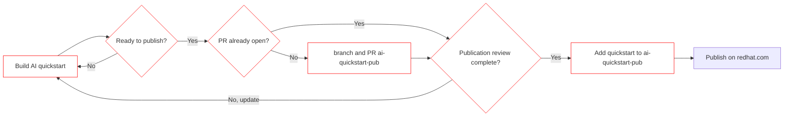

# Welcome to the publisher's guide! :book: 

This page describes how we publish. 

## General overview

**Decision point still required**
Options:
1. repos are linked to specific commit using submodules 
2. content is copied into pub repo and maintained separately

*Assuming submodules for now.*

## Steps overview

0. Requirements to be considered for publication:
   1. repository part of the [quickstart org](https://github.com/rh-ai-quickstart) organization 
   2. can be a fork of an upstream repository, or
   3. originates in [quickstart repos](https://github.com/orgs/rh-ai-quickstart/repositories)

1. Create GH publication review issue
   1. publication process must be tracked as GH issue (issues in future)
   2. (optional) openhands pre-preparation

2. Collaborate to get publication ready
   1. manually create appropriate sub tasks
   2. contributor must: 
   3. facilitate review
   4. work with reviewers/stakeholders 
   5. Accept/reject/pull changes as appropriate
	  1. note: if resolution not found, publication delayed

3. Final review
   1. double check readiness

4. technical stuff
   1. git submodule applicable commit 

5. site build, ci

## Dependencies (read: stuff to do still)

**add rulset requiring PR to ai-quickstart-pub and review by pub team**
**make sure members can read and create new branches and PRs, but do not have access to main**
**create PR template**
**SSG template**

**publication repo** 
- private 
- proposed permissions:
  - public: invisible
  - org members: read (still need ability to create ISSUE)
  - SMEs: write (may not be needed)
  - stakeholders: admin (full control over publication content)
	- cross functional team
      - CAI 
	  - AI Eng representative? 
	  - AI BU PMM 
	  - RH Digital representatives (full control to remediate, if needed)
	  - 

**determine location of publication review request**
- within specific quickstart, or 
- in ai-quickstart-contrib with link, or 
- in pub repo <-

**gh issue publication template**
- request a repo be reviewed/considered for publication on redhat.com
- checklist for current status 
  - reads well 
  - demonstrated working 
  - has vertical use case (or, help needed) 
  - professionally written
  - optional arcade takes priority
  - README has all required sections, tags and links

**Red Hat dot com tactical requirements**
- this exists, ie accessibility get from rh-digital

**FUTURE: ability to group/cascade issues** 
- if quickstart is "approved" for publication evaluation 
  - confirm each step of "current status" from original ticket
  - FUTURE: generate GH issue for each status line for gant, etc
  
**need vetting by multiple people**
- why 
  - removes bias
  - increases speed 
  - business continuity 
  - stakeholder visibility & participation
- who
  - AI CAI representatitve 
  - AI Engineering 
  - Eco Eng. 
  - RH .com 
- process
  - need two reviewers 
  - two reviewers at each stage? or, two reviewers total?
