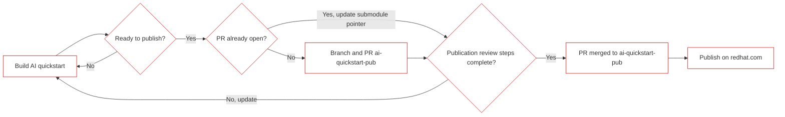
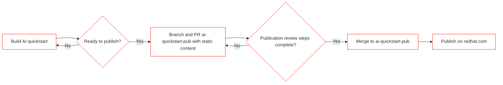

# Welcome to the publisher's guide! :book: 

This page describes how we publish. 

## General overview

**Decision point still required**
Options:
1. repos are linked to specific commit using submodules 
2. content is copied into pub repo and maintained separately

*Assuming submodules for now.*

### `git sumbodule` proposed flow 

### simple markdown flow 

### two options compared 

| | pros | cons |
| --- | --- | --- |
| submodule | content in original repo will more closely match catalog site | more complicated publication steps, still gets stale | 
| static markdown | publication steps easier, options to manage tags separately| larger gap between repo and catalog page |

## Publication steps (detailed) 

0. Build AI quickstart
   1. repository part of the [quickstart org](https://github.com/rh-ai-quickstart) organization 

1. Branch and PR ai-quickstart-pub
   1. members have access to create new branches and submit pull requests
   2. create branch, make appropriate changes, PR
   3. this step can be completed by quickstart owner, or pub team member

2. Publication review steps complete
   1. double check readiness
   2. work through PR checklist

3. Merge to ai-quickstart-pub

## Dependencies (read: stuff to do still)

**publication repo** 
- proposed permissions:
  - add rulset requiring PR to ai-quickstart-pub and review by pub team
  - make sure members can read and create new branches and PRs, but do not have access to main
  - org members: read (still need ability to create ISSUES, BRANCHES, & PRs)
  - pub team: admin (full control over publication content)
	- cross functional team
      - CAI 
	  - AI Eng representative? 
	  - AI BU PMM 
	  - RH Digital representatives (full control to remediate, if needed)

**Red Hat dot com tactical requirements**
- this exists, ie accessibility get from rh-digital
  
**create PR template**

**SSG template**
