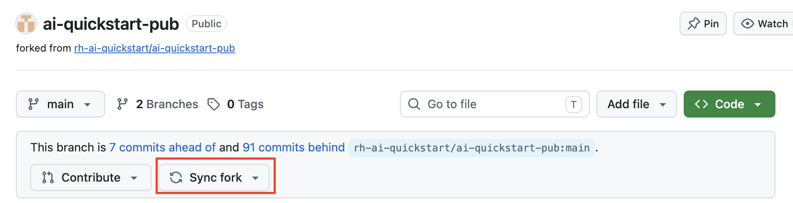

# Publishing guide

This guide covers requirements and process to publish your quickstart to the [AI quickstart catalog](https://docs.redhat.com/en/learn/ai-quickstarts) on redhat.com.

---

## Table of Contents

* [Before you publish: quality standards](#before-you-publish-quality-standards)
  * [Naming and branding consistency](#naming-and-branding-consistency)
  * [Content quality (style, accessibility, SEO)](#content-quality)
  * [Legal and compliance](#legal-and-compliance)
  * [README quality standards](#readme-quality-standards)
* [The publishing process](#the-publishing-process)
  * [Prerequisites](#prerequisites)
  * [Submit for publication](#submit-for-publication)
  * [The review process](#the-review-process)
  * [Update an existing quickstart](#update-an-existing-quickstart)
  * [Update an open Pull Request](#update-an-open-pull-request)

---

## Before you publish: quality standards

Creating content that meets Red Hat's corporate standards ensures your quickstart publishes faster and protects Red Hat legally. Following these practices makes your content compliant, accessible, and optimized for search.

### Naming and branding consistency

Improper product naming is the most common reason for editorial delays. Accurate naming protects our trademarks and ensures a professional brand presence.

* **Use the Official List:** Always cross-reference the [Official Red Hat Product Names List](https://docs.google.com/spreadsheets/d/1DLS_lS3VKidgZIvcLmLp9BoiqptkvqHWfe1D5FD2kfk/edit?gid=1259317633#gid=1259317633) (OPL).
* **The "First Mention" Rule:** Use the full product name with the appropriate trademark symbol on the first mention _only_ (e.g., **Red Hat® OpenShift®**) on the first mention. Subsequent mentions can use approved short names (e.g., **OpenShift**). Always refer to the OPL for the latest information on short names.
* **Abbreviations:** Ensure the product name is stylized correctly. If a trademark or registered mark is required, include it. Avoid unauthorized abbreviations like "RHAI" or "RAI." For more information, always refer to the OPL.

### Content quality

The [BX Content Toolbox](https://red.ht/content-toolbox) is your primary resource for self-editing (VPN Required). Using these tools before submission will speed up the publishing process and save Red Hat money.

**Key Focus Areas:**
* **Style Guide:** Check for Red Hat-specific grammar, punctuation, and "voice and tone" (conversational yet professional).
* **Accessibility Analyzer:** Ensure your quickstart meets WCAG 2.2 AA standards.
  * **Headings:** Use logical nesting (H2 > H3).
  * **Alt Text:** All images must have descriptive alt text that explains the function or meaning of the image, not just a literal description. AI tools can help generate alt text. Consider using a prompt asking for accessibility alt text for your image.
    * For example, markdown image links should be descriptive: `[Architectural diagram for document ingestion](path to image)`, NOT `[image1](path to image1)`
* **Inclusive Language:** Use the analyzer to flag non-inclusive terms (e.g., replace "master/slave" with "primary/secondary" or "blacklist" with "blocklist").

**SEO Best Practices**

* **Short Descriptions:** Every guide must start with a concise, 1-2 sentence abstract that summarizes the value proposition.
* **Keywords:** Include "AI," "quickstart," and the specific product name in the first paragraph.
* **Link Text:** Use descriptive link text. Avoid "Click here" or "Read more." Use "Download the Red Hat Enterprise Linux installation guide."

### Legal and compliance

To ensure your quickstart is discoverable and legally sound, follow these requirements:

**Legal & AI Compliance**

* **Disclosure:** If any part of the quickstart was generated using AI, consult legal on whether a disclosure (e.g., "Assisted-by: AI") is required.
* **No Guarantees:** Avoid language that "guarantees" specific performance metrics or outcomes, as AI results can vary based on user data.
* **Copyright:** Do not use copyrighted third-party material or logos within your examples.

---

### README quality standards

#### Required content completeness

Your README must include all required sections from the [README structure requirements](CONTRIBUTING.md#readme-structure-requirements):
- Action focused AI quickstart title starting with an action verb 
- H1 title that describes the business solution 
- H1 title must be less than 64 characters 
- Short description expands on business solution
- Short description is fewer than 160 characters
- Detailed description (2-3 paragraphs) offering details on business solution
- Architecture diagrams images  
- Requirements (hardware & software - be specific!) 
- Deploy instructions 
- Delete instructions 
- Tags in dedicated "Tags" section at bottom of README 
- Industry tag is in approved Industry list
- README describes a quickstart consistent with "Best practices" in the [What Makes a Good Quickstart](CONTRIBUTING.md#what-makes-a-good-quickstart) section
- README DOES NOT have "Common Pitfalls" described in [What Makes a Good Quickstart](CONTRIBUTING.md#what-makes-a-good-quickstart) 

Missing any required section from the [README structure requirements guide](CONTRIBUTING.md#readme-structure-requirements) is a **Blocker**.

#### Review severity levels 

Issues with your README file are classified by severity: 

##### **🚫 BLOCKER** - Must Fix Before Publication

**Criteria:** 
- **Security vulnerabilities:** Hard coded credentials, API keys, passwords in examples, or exposed secrets 
- **Broken critical paths:** Installation links return 404, deployment instructions are missing steps, or required actions are abset
- **Impossible deployment:** Requires manual admin approval, emailing for license files, or access to resources not publicly available 
- **Missing required README component:** README is missing any required section from [README structure requirements](CONTRIBUTING.md#readme-structure-requirements)
- **Exceeding H1 title character limits:** The H1 README title **MUST** be shorter than maximum character length defined in [README structure requirements](CONTRIBUTING.md#readme-structure-requirements)
- **Exceeding short description character limit:** The short description, normal text immediately following the H1 title in the README **MUST** be shorter than maximum char length defined in [README structure requirements](CONTRIBUTING.md#readme-structure-requirements)
- **Broken README links:** broken links to diagrams, internal or external links in the README file
- **Inappropriate Tagging:** Industry tag must reference [Red Hat approved industry tag](CONTRIBUTING.md#industry-tags)
- **Tag format:** Tags must be in dedicated section at the bottom of the README, in a bulleted list with key and value pairs with key in bold and value in normal text
- **Appropriate industry tag:** Industry indicated in the `* **Indsustry:** [INDUSTRY]` bullet must be listed in the [Industry tags](CONTRIBUTING.md#industry-tags) section
- **Meets good quickstart criteria:** Is consistent with "Best practices" and does not have "Common Pitfalls" described in [What Makes a Good Quickstart](CONTRIBUTING.md#what-makes-a-good-quickstart)

**Examples:**
- ❌ Hardcoded password: `ADMIN_PASSWORD=secret123` in deployment instructions
- ❌ Installation link to a non-existent or inaccessible URL
- ❌ README states "Contact admin@redhat.com to request access to the license file"
- ❌ Missing Prerequisites, Installation, or Usage sections entirely
- ❌ Link to architectural diagram is broken
- ❌ `Industry: HR`
  - HR is not an approved industry tag
  - Entry is not a bulleted list
  - Industry is not bold

##### **⚠️ MAJOR** - Should Fix Before Publication

Quality issues that don't prevent publication but significantly impact user experience or brand compliance.

**Criteria:**
- **Trademark violations:** Trademark symbols (® or ™) used incorrectly (see [Naming and Branding Consistency](#naming-and-branding-consistency))
- **Structural problems:** Poor organization, missing recommended sections, or illogical flow
- **Unclear instructions:** Steps work but are confusing, lack context, or assume undocumented knowledge
- **Significant style violations:** Inconsistent formatting, unprofessional language, or accessibility issues
- **Technical inaccuracies:** Commands work but are suboptimal or misleading

**Examples:**
- "OpenShift™ AI uses OpenShift™ operators" (trademark symbol repeated - should only be on first mention)
- Missing Troubleshooting section for a complex multi-step deployment
- Command shown as `sudo ./install.sh` without explaining why sudo is required
- Using non-inclusive language flagged by the Content Toolbox analyzer

**IMPORTANT:** Trademark formatting issues are **ALWAYS "major"**, never "blocker". They impact brand compliance but don't prevent deployment.

##### **ℹ️ MINOR** - Nice to Have

Polish improvements that enhance clarity or consistency but don't significantly impact functionality or user success.

**Criteria:**
- Minor formatting inconsistencies (heading levels off by one, inconsistent bullet styles)
- Wordiness or opportunities for clearer phrasing
- Missing optional sections (FAQs, Related Resources, Additional Examples)
- Small style improvements that don't affect comprehension

**Examples:**
- Minor inconsistency: Some sections use numbered lists, others use bullets for similar content
- A paragraph that could be reworded for clarity but is still understandable
- Missing a "Related Resources" section

##### **💡 SUGGESTION** - Optional Enhancements

Non-critical improvements that could enhance the quickstart but aren't necessary for publication.

**Criteria:**
- Style preferences beyond Red Hat standards
- Additional examples that would be helpful but aren't required
- Future enhancements or ideas for the next version
- Alternative approaches or recommendations

**Examples:**
- "Consider adding a diagram showing the architecture"
- "Could include an advanced configuration example for power users"
- "Might benefit from a video walkthrough"

#### Classification decision rules

When uncertain which severity level to assign, use these decision rules:

1. **Default to lower severity:** If torn between two levels, choose the less severe classification
2. **Security and deployment first:** 
   - Does it expose credentials or secrets? → **Blocker**
   - Does it prevent successful deployment? → **Blocker**
   - Everything else is not a blocker
3. **Trademark is always Major:** No matter how many violations, trademark issues are brand compliance, not deployment blockers
4. **User impact test:**
   - Would a user be unable to complete deployment? → **Blocker**
   - Would a user struggle significantly or get confused? → **Major**
   - Would a user notice but still succeed? → **Minor**
   - Is it a "nice to have"? → **Suggestion**

#### Common edge cases

**"The README has 10 trademark violations - isn't that a blocker?"**
- No. Even multiple trademark issues are **Major**. They need fixing for brand compliance, but don't prevent deployment.

**"The installation link works but goes to an outdated version"**
- **Major** if the outdated version still works but causes confusion
- **Blocker** if the outdated version is incompatible or broken

**"There's a typo in a critical command"**
- **Blocker** if the typo breaks the command (e.g., `kubectl get pods` misspelled as `kubctl get pods`)
- **Major** if the typo is in explanatory text but command is correct
- **Minor** if it's in supplementary documentation

**"The README is missing a Troubleshooting section"**
- **Major** for complex deployments where users will likely encounter issues
- **Minor** for simple deployments with few failure modes

---
## The Publishing Process

### Prerequisites

1. quickstart repository is in the [AI quickstart GitHub organization](https://github.com/rh-ai-quickstart)
2. quickstart meets [repository requirements](CONTRIBUTING.md#repository-requirements)

### Submit for publication

Using gitflow workflow: 
1. Fork [ai-quickstart-pub](https://github.com/rh-ai-quickstart/ai-quickstart-pub) to your personal GH profile
2. Clone your forked repo to your local machine and `cd` to the directory
3. Create a new branch from main with a _descriptive_ branch name: 
```
# update branch name first
git checkout -b [INSERT BRANCH NAME HERE] 
```
4. Add a _submodule_ to the `quickstart/` folder using this command (update with your quickstart repo name first).
```
# assuming reference to main:latest
# update your repo details
git submodule add https://github.com/rh-ai-quickstart/INSERT-QUICKSTART-REPO-NAME.git quickstart/INSERT-QUICKSTART-REPO-NAME
```
> NOTE: Please use the quickstart repo name in both arguments. They **must** match. For example, `git submodule add https://github.com/rh-ai-quickstart/hello-world.git quickstart/hello-world`. Something like `quickstart/world-greeting` will fail. 
5. Next, commit the change: 
```
git add quickstart/INSERT-QUICKSTART-REPO-NAME

# don't have to follow this commit message exactly, but use something descriptive please
git commit -m "init: INSERT-QUICKSTART-NAME"
```
6. Push commit to your forked repository `git push -u origin INSERT-QUICKSTART-BRANCH-NAME`
7. Open a pull request to the organization's [ai-quickstart-pub](https://github.com/rh-ai-quickstart/ai-quickstart-pub) main branch
8. PR will be reviewed and approved by the `publication-admin` team. Please be available to make changes or updates during the review.

### The review process

After you submit a PR, your quickstart goes through a two-stage review process:

#### 1. Automated review

An AI-powered review automatically checks your README against the [README Quality Standards](#readme-quality-standards) defined above.

**What it checks:**
- All required sections are present
- Trademark usage follows the "first mention only" rule
- No hardcoded credentials or security issues
- Links are working and accessible
- Instructions are clear and complete
- Follows Red Hat style and branding guidelines
- Character limits are respected (title <64 chars, short description <160 chars)

**What you receive:**
- A PR comment with categorized findings (Blocker/Major/Minor/Suggestion)
- Summary count of issues by severity
- Detailed descriptions with specific locations and suggested fixes
- References to which guidelines were violated

#### 2. Manual review

The `publication-admin` team performs a final review for:
- Content accuracy and technical correctness
- Overall quality and polish
- Final approval for publication

**Your responsibility:**
- **Address all Blockers** - These must be fixed before merging
- **Address Major issues** - Strongly recommended before publication
- **Be available** to respond to questions and make updates promptly
- **Ask questions** if any feedback is unclear

The review process ensures consistent quality across all published quickstarts while helping you improve your content.

### Update an existing quickstart

This section documents how to update a _previously_ published AI quickstart. That is, a quickstart with and accepted and closed Pull Request. In this case, you will open a new Pull Request to update. Please see the [Update an open Pull Request](#update-an-open-pull-request) section to update open publication Pull Requests.

1. Update your forked `ai-quickstart-pub` repo since it might be out of date. Sync the fork:

2. Open your command line, change to your local clone of your forked version of [ai-quickstart-pub](https://github.com/rh-ai-quickstart/ai-quickstart-pub), update main
   ```
   # This is where I keep it, your path may be different. Update QS_PATH or cd to appropriate location
   export QS_PATH=~/projects/rh-ai-quickstarts/
   cd $QS_PATH/ai-quickstart-pub
   git checkout main 
   git pull 
   ```
3. Next, let's update or create a branch to update the submodule. Pick one of the following options:
   1. If you have an existing branch (from the original submission) you want to re-use, first check it out and merge with main. For example:
      ```
      git checkout [INSERT ORIGINAL BRANCH NAME HERE] # switch to existing branch
      git merge main # merge latest changes on main with your branch
      # resolve conflicts, if applicable
      ```
   2. If you don't have an existing branch or don't want to re-use the original one, create a new branch from `main`
      ```
      git checkout -b [INSERT NEW BRANCH NAME HERE] # new branch already synced with main 
      ```
4. Check status of your quickstart's submodule (using `llm-cpu-serving` as an example), directory **should not be empty**:
   ```
   ls quickstart/[INSERT-quickstart-repo-name-here] # should return directory contents
   ```
   1. If directory is **NOT empty**, go to step 5.
   2. If directory **IS empty**, we need to update the submodule first. From the `$QS_PATH/ai-quickstart-pub` directory:
      ```
      git submodule update --init quickstart/[INSERT-quickstart-repo-name-here]
      ls quickstart/[INSERT-quickstart-repo-name-here]

      # using llm-cpu-serving as an example
      # $ ls quickstart/llm-cpu-serving
      # $ git submodule update --init quickstart/llm-cpu-serving
      # $ ls quickstart/llm-cpu-serving
      # docs  helm  README.md
      ```

5. Change directories to your quickstart submodule and `git pull` to update to main:latest
   ```
   cd quickstart/[INSERT-quickstart-repo-name-here] # cd quickstart/llm-cpu-serving
   git pull
   ```
6. Your submodule no longer points to a previous commit. It points to main latest now. Change back to your `ai-quickstart-pub` root directory
   ```
   cd ../../ # OR 
   # cd $QS_PATH/ai-quickstart-pub
   ```
7. Next, we stage for commit, commit with message and push to personal github 
   ```
   git add quickstart/[INSERT-quickstart-repo-name-here] # E.G - git add quickstart/llm-cpu-serving
   git commit -m "Updated quickstart to latest commit"
   git push -u origin [INSERT BRANCH NAME HERE]
   ```
8. Open a new Pull Request in [rh-ai-quickstart/ai-quickstart-pub](https://github.com/rh-ai-quickstart/ai-quickstart-pub/pulls) 


### Update an open Pull Request

This section describes the update process for _open_ publication Pull Requests. The most common scenarios are: 
* You want to make changes to a PR you recently submitted for publication. The PR has _not_ been accepted yet. 
* You are making requested changes from the AI or human review processes before the PR can be accepted.
* You previously published a quickstart, made changes, submitted a new PR but want to make new changes while the PR is still open.

> **REMEMBER:** Pull Requests opened in `ai-quickstart-pub` are _submodules_. They are links to specific commits in your quickstart repo. In general, this is a 2 step process: 1) update your quickstart and 2) update the submodule in your open PR to point to the recent changes. We will cover this below. 

**Steps:** 
0. Assuming the following is true: you have an open Pull Request in [rh-ai-quickstart/ai-quickstart-pub](https://github.com/rh-ai-quickstart/ai-quickstart-pub/pulls) because you followed the docs above, AND you already updated and committed changes to your quickstart
1. Change directories to your forked `ai-quickstart-pub`
   ```
   export QS_PATH=~/projects/rh-ai-quickstarts/ # Update QS_PATH or cd to appropriate location
   cd $QS_PATH/ai-quickstart-pub                # change directories to your forked ai-quickstart-pub
   ```
2. Use the branch you used for your open PR
   ```
   git branch                             # shows you what branch your on, skip the next if already on the right branch
   git checkout [INSERT BRANCH NAME HERE] # run this command if you need to switch branches  
   ```
3. Check status of your quickstart's submodule (using `llm-cpu-serving` as an example), directory **should not be empty**:
   ```
   ls quickstart/[INSERT-quickstart-repo-name-here] # should return directory contents
   ```
   1. If directory is **NOT empty**, go to step 4.
   2. If directory **IS empty**, we need to update the submodule first. From the `$QS_PATH/ai-quickstart-pub` directory:
      ```
      git submodule update --init quickstart/[INSERT-quickstart-repo-name-here]
      ls quickstart/[INSERT-quickstart-repo-name-here]

      # using llm-cpu-serving as an example
      # $ ls quickstart/llm-cpu-serving
      # $ git submodule update --init quickstart/llm-cpu-serving
      # $ ls quickstart/llm-cpu-serving
      # docs  helm  README.md
      ```

4. Change directories to your quickstart submodule and `git pull` to update to main:latest
   ```
   cd quickstart/[INSERT-quickstart-repo-name-here] # E.G. - cd quickstart/llm-cpu-serving
   git pull
   ```
5. Your submodule no longer points to a previous commit. It points to main latest now. Change back to your `ai-quickstart-pub` root directory
   ```
   cd ../../ # OR 
   # cd $QS_PATH/ai-quickstart-pub
   ```
6. Next, we stage for commit, commit with message and push to personal github 
   ```
   git add quickstart/[INSERT-quickstart-repo-name-here] # E.G - git add quickstart/llm-cpu-serving
   git commit -m "Updated quickstart to latest commit"
   git push -u origin [INSERT BRANCH NAME HERE]
   ```
7. Open your PR in [rh-ai-quickstart/ai-quickstart-pub](https://github.com/rh-ai-quickstart/ai-quickstart-pub/pulls) and confirm most recent commit is present
8. Reach out through internal channels for assistance
