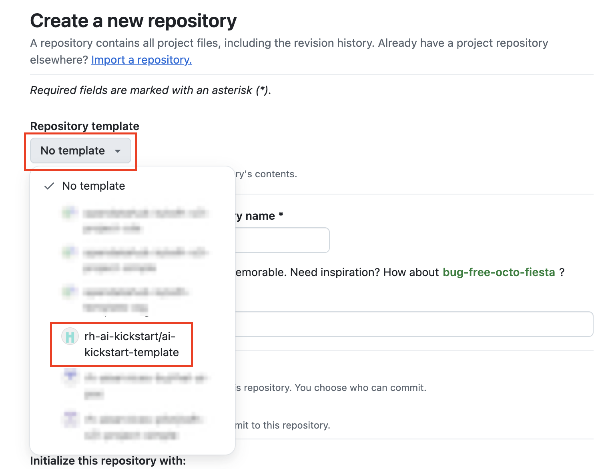

# Welcome to the contributor's guide (FAQ)! :computer: 

**Table of contents** 

* [How are AI kickstarts organized?](#how-are-ai-kickstarts-organized)
* [ What are the repository requirements?](#what-are-the-repository-requirements)
* [Is there a template repository?](#is-there-a-template-repository)
* [How do I create a new kickstart?](#how-do-i-create-a-new-kickstart)
* [What is the ai-kickstart-contrib repository?](#what-is-the-ai-kickstart-contrib-repository)

## Frequently asked questions :question: 

### How are AI kickstarts organized? 

Every AI kickstart is its own repository. We do this so they are easy to browse,
clone and deploy! AI kickstarts are collected here in the 
[AI kickstart GitHub Organization](https://github.com/rh-ai-kickstart). 

Here's what it looks like: 

```
rh-ai-kickstart/
├── [vllm-cpu]()/
│   ├── README.md 
│   ├── assets/images/
│   └── helm/
└── [vllm-tool-calling]()/
    ├── README.md 
    ├── assets/images/
    └── vllm-tool-calling/
```

### What are the repository requirements? 

Firstly, they are evolving. Please be patient :smile: ! 

Here are the repository requirements: 

* `README.md` 
* `assets/images`  
* Put the images your README uses in the `assets/images/` folder

Here's why: 

* READMEs are extracted and used for promotion on
[ai-on-openshift.io](https://ai-on-openshift.io/) 
and 
[redhat.com](https://redhat.com) (**future, TBD**). 
* GitHub Actions automate extraction so resources should be organized consistently

### Is there a template repository? 

Yes. We got you! 

The `ai-kickstart-template` repository will prepopulate your repository with: 
 
* a README.md file - **NOTE** You'll want to replace the text! 
* `assets/images/` folder to store images supporting your README
* `.github/workflows/` GH Actions to manually submit a PR for publication

### How do I create a new kickstart? 

#### 1. Click "Repositories" in the [AI kickstart
org](https://github.com/rh-ai-kickstart)


#### 2. Click "New repository" (top right) 


#### 3. Click "No template" and select `rh-ai-kickstart/ai-kickstart-template`



#### 4. Give your repository a name, make it Public and "Create repository"  

#### 5. Build! :rocket:

#### 6. **P.S.** Remember to update *placeholder* text in the template README

### What is the ai-kickstart-contrib repository? 

