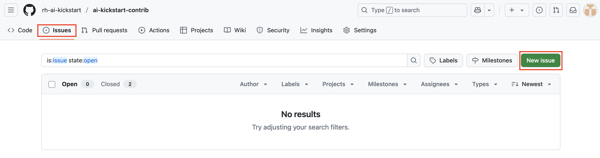
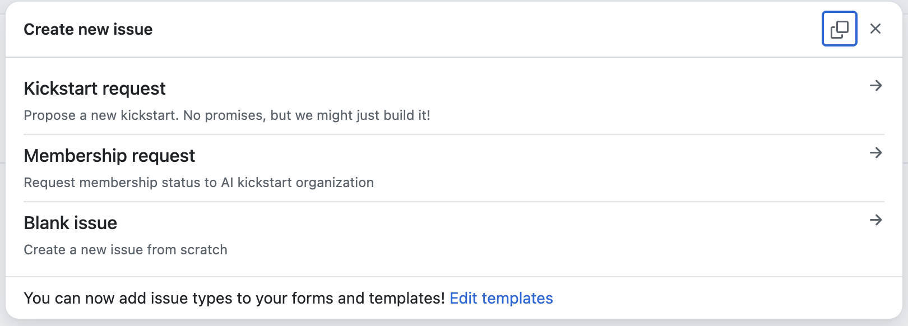

# The (eventually) complete user guide to AI kickstarts! :raised_hands: 

This *user guide* is an effort 
to put everything you'll need to know about AI kickstarts in one place. It
exists to make sure you're successful with AI kickstarts. 

AI kickstart creators may want to start with the 
[contributor's guide](CONTRIBUTING.md)
instead.

## Table of contents
* [General AI kickstart information](#general-ai-kickstart-information)
* [Getting started](#getting-started)
* [Getting help, submitting feedback and making requests](#getting-help-submitting-feedback-and-making-requests)

## General AI kickstart information 

### AI kickstarts definition 

Kickstarts are simple, ready-to-use AI examples using Red Hat platforms. 
They are straightforward and focused example use cases - easy to launch, easy to
get, and *ready to go!*

Kickstarts exist because some of us learn by doing and want evidence, proof, or
to simply get started as quickly as possible. **If that sounds like you, you're
in the right place.** Please continue reading!

### "Logistics" 

AI kickstarts are collected in the 
[AI kickstarts GitHub Organization](https://github.com/rh-ai-kickstart). 
Each repository is a kickstart making it easy for you to get started. 

Red Hatters, our partners and community members create and maintain AI
kickstarts for anyone to use in their Red Hat AI platform. Each kickstart is
stored as a repository in the 
[AI kickstarts GitHub Organization](https://github.com/rh-ai-kickstart). 
Organizing kickstarts this way makes them easier to maintain long term. 

Every repository is an AI kickstart with a few notable exceptions: 
* [The .github repository](https://github.com/rh-ai-kickstart/.github) - is the landing page for AI kickstarts. You can safely ignore it.
* [ai-kickstart-template](https://github.com/rh-ai-kickstart/ai-kickstart-template) - is a template repository for creators to get started easily.
* [ai-kickstart-contrib](https://github.com/rh-ai-kickstart/ai-kickstart-contrib) - is where we document, manage projects and plans, and interact with the community through Github issues, for example. This is where you get help if you need it. 

## Getting started

### Deployment tool prerequisistes 

The tools you need depend on the kickstart you want to deploy. Each kickstart
will document the specific tools needed. 

But, consider installing these commonly used tools beforehand to save yourself time. 

| Useful Tool | Description | Link to instructions | 
| --- | --- | --- | 
| `git` | Easily clone (download) AI kickstarts before deployment | [Installing git](https://git-scm.com/book/en/v2/Getting-Started-Installing-Git) | 
| `oc` | Tool makes it easy to connect to OpenShift and deploy kickstarts | [OpenShift CLI (oc)](https://docs.redhat.com/en/documentation/openshift_container_platform/4.8/html/cli_tools/openshift-cli-oc#cli-getting-started) | 
| `helm` | Package manager for kubernetes | [Helm CLI](https://docs.redhat.com/en/documentation/openshift_container_platform/4.3/html/cli_tools/helm-cli#getting-started-with-helm-on-openshift-container-platform)  | 
| `make` | Automates builds and tasks | Included in \*nix environments use package managers or trusted installation instructions for Windows environments | 

These tools are useful to have especially when you're deploying from a local
terminal. Alternatively, your cluster administrator could install the 
[OpenShift Web Terminal operator (4.16)](https://docs.redhat.com/en/documentation/openshift_container_platform/4.16/html/web_console/web-terminal#installing-web-terminal)
to deploy examples directly from OpenShift. 

Remember, create an 
[issue](https://github.com/rh-ai-kickstart/ai-kickstart-contrib/issues)
 if you would like help or updates to this documentation. 

### Deploy your first kickstart! :rocket: 

Launch a private chatbot using the 
[LLM CPU Serving kickstart](https://github.com/rh-ai-kickstart/llm-cpu-serving). 

**Here's what you'll need to do:**
1. Read through the [README](https://github.com/rh-ai-kickstart/llm-cpu-serving)
2. Follow directions in the "[Install](https://github.com/rh-ai-kickstart/llm-cpu-serving?tab=readme-ov-file#install)" section 
3. Launch the chatbot

*Simple & ready to go!* 

## Getting help, submitting feedback and making requests 

All feedback is welcome. Specific and actionable feedback is preferred. Please
create a GitHub issue directly in the kickstart repository whenever possible.

For general feedback, please create an
[issue in ai-kickstart-contrib](https://github.com/rh-ai-kickstart/ai-kickstart-contrib/issues)
. General requests may resemble: 
* General help requests 
* Suggesting a new AI kickstarts 
* General feedback

If you're **ever unsure** where to submit a request, just submit an "issue" in the 
[ai-kickstart-contrib repository](https://github.com/rh-ai-kickstart/ai-kickstart-contrib/issues).

### Here's how to submit a general request. 
1. Navigate to [ai-kickstart-contrib](https://github.com/rh-ai-kickstart/ai-kickstart-contrib/tree/main)
2. Select "[Issues](https://github.com/rh-ai-kickstart/ai-kickstart-contrib/issues)"
3. Click the green "New issue" button, top right 

4. Pick an appropriate issue type 

### Other 

**Kickstart suggestion** can be used to suggest a new kickstart. Please note, all
suggestions are welcome but there are no guarantees we'll be able to build it! 

Please use **Membership request** to request official membership to the AI
kickstart Github organization. Membership allows you to create AI kickstart
repositories for others to use. 

Use "Blank issue" for all other requests, feedback or anything else on your
mind. 

