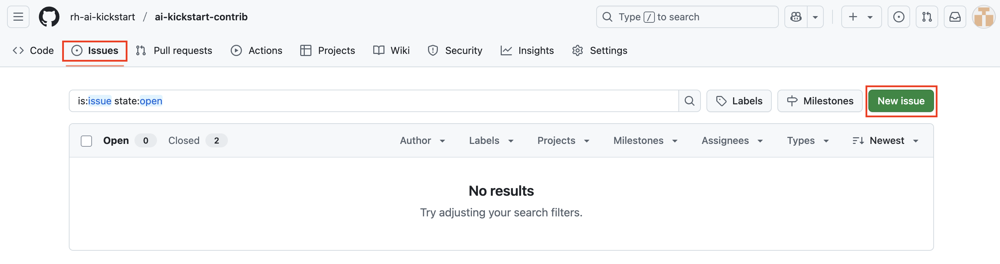
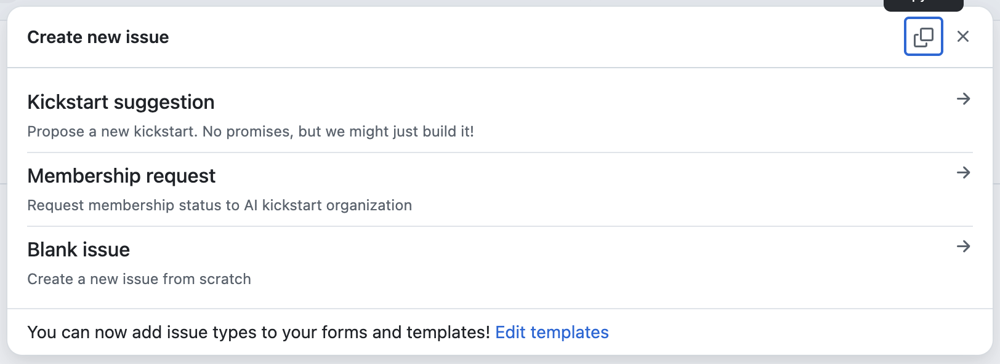

# Welcome adventurer!

This guide contains everything you need to deploy AI quickstarts.

---

## Skip tutorial?

1. Browse the **[AI quickstart catalog](https://docs.redhat.com/en/learn/ai-quickstarts)**
2. Pick a quickstart that interests you
3. Follow the README deployment instructions
4. Done! 

---

## Run tutorial!

AI quickstarts are **simple, ready-to-deploy AI examples** for Red Hat platforms.

They are:
- ✅ **Straightforward** — Easy to launch and use
- ✅ **Focused** — Real business use cases, not just demos
- ✅ **Ready to go** — Deploy with intructions provided

Quickstarts exist because some of us learn by doing and want to see what open source AI can bring. If that sounds like you, **you're in the right place!**

---

> "It's dangerous to go alone. Take this..."🗡️

| Tool | What it does | Install |
| --- | --- | --- |
| `git` | Clone quickstarts | [Install git](https://git-scm.com/book/en/v2/Getting-Started-Installing-Git) |
| `oc` | Deploy to OpenShift | [OpenShift CLI](https://docs.redhat.com/en/documentation/openshift_container_platform/4.8/html/cli_tools/openshift-cli-oc#cli-getting-started) |
| `helm` | Kubernetes package manager | [Helm CLI](https://docs.redhat.com/en/documentation/openshift_container_platform/4.3/html/cli_tools/helm-cli#getting-started-with-helm-on-openshift-container-platform) |
| `make` | Automate builds | Included in Linux/Mac |

Most quickstarts use these tools. Consider installing them to save time. Certain quickstarts might require other tools which should be specified under the "Requirements" for that specific quickstart.     
**Pro tip:** You can also use the [OpenShift Web Terminal](https://docs.redhat.com/en/documentation/openshift_container_platform/4.16/html/web_console/web-terminal#installing-web-terminal) to deploy directly from your browser!

---

##  Where to find quickstarts?

**Main catalog:**  
🌟 **[AI quickstart catalog on redhat.com](https://docs.redhat.com/en/learn/ai-quickstarts)** — Curated, polished examples

**All repositories:**  
📦 **[GitHub organization](https://github.com/orgs/rh-ai-quickstart/repositories)** — Full collection including experimental ones. 

**Understanding repository labels:**

When browsing quickstarts, look for these GitHub labels to understand their status:
- 🟢 **`completed`** - Quickstart is finished, tested, and ready to deploy
- 🟡 **`work-in-progress`** - Quickstart is being built and not yet finished
- ⭐ **`published`** - Quickstart is featured in the curated catalog on redhat.com
- 🔴 **`deprecated`** - Quickstart is on its way out and no longer maintained

These labels help you find quickstarts that are ready to use! 

**Helper repos** (not quickstarts, but meant to help us maintainers to organise and assist you ):
- `.github` — Organization profile
- `ai-quickstart-template` — Template for creators
- `ai-quickstart-contrib` — This documentation hub

---

## Need help?

- 📝 [Open an issue](https://github.com/rh-ai-quickstart/ai-quickstart-contrib/issues)
- 🎯 File issues in the specific quickstart repo if it's related to a specific quickstart
- 💡 Suggest new quickstarts, we love to hear your idéas!

### How to submit an issue

1. Navigate to [ai-quickstart-contrib](https://github.com/rh-ai-quickstart/ai-quickstart-contrib/tree/main)
2. Select "[Issues](https://github.com/rh-ai-quickstart/ai-quickstart-contrib/issues)"
3. Click the green "New issue" button, top right

4. Pick an appropriate issue type

---

_Happy exploring!_ 🚀   
_Built by Red Hat AI experts, partners, and the community_ ✨

